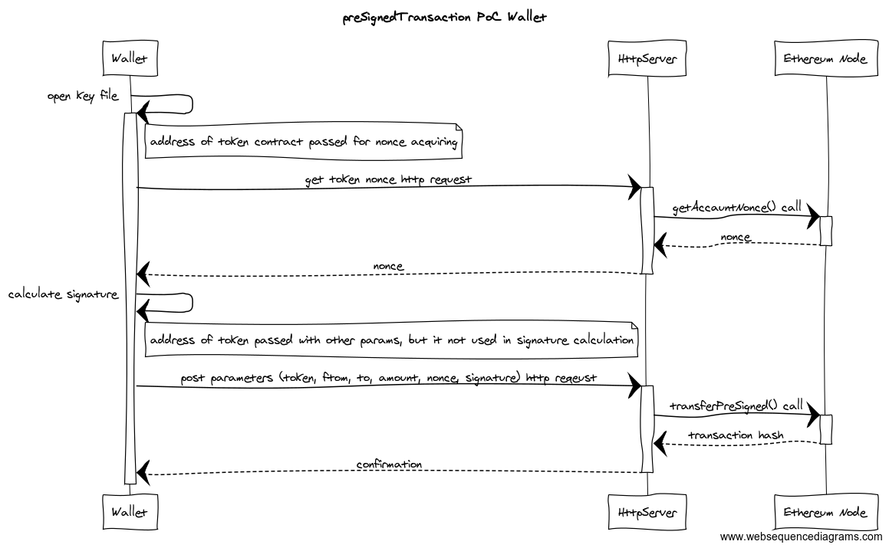

# Repository structure
  - contracts - smart contract source code
  - web - html pages for wallet and token creator
  - http_server - js server files
  - http_server/out - compiled abi and bytecode of used contracts
 
# How it works
All on-chain actions are performed by remote http server. Web pages can only send or get some parameters with GET/POST http requests or generate signature based on specified private key.



Main idea is sending transaction parameters and signature to remote server, wich will perform on-chain transaction.
First, web client will receive nonce parameter for specified address from http server, which will get nonce from token contract by calling getAccountNonce().
After nonce received by wallet, it will calculate signature based on wallet address, receiver address, tokens mount and nonce. Then transaction parameters with calculated signature and token address will be sent to http server. And http server based on received info will try to perform transaction. All work is done in transferPreSigned() function, sender address will be recovered form signature and passed parameters. And if everything is fine then tokens will be transfered from wallet address to receiver.
As all on-chain action will be performed on server, all transactions fees will be payed only by server.

## Building
To build the smart contract, first install dependencies:

``` npm install openzeppelin-solidity ```

Then compile the smart contract using `solc`.

In case if solc was installed not by npm you should specify prefix for imported files.

```solc <params> openzeppelin-solidity=node_modules/openzeppelin-solidity/contracts```

# How to run PoC
First you need to install http server dependencies.
For http server used [express](https://expressjs.com/) framework.

```npm install express --save```

For interaction with ethereum node used [web3](https://github.com/ethereum/web3.js/).

```npm install web3```

> In some cases you should init node project before instlling dependencies. You can do this with ```npm init```.

Before starting script you should change hardcoded web3 provider and default account in [http_server/helpers.js](http_server/helpers.js). All on-chain operations will be performed from that account, so this account should be unlocked and should be able to pay transactions fees.
Also, contracts deployed by this server will be owned by default account. This is important because only owner allowed to perform preSignedTransactions.
Another hardcoded parameters are pathes to files with contract abi and bytecode. But for running this PoC you don't need to change anything.

After installing dependencies and changing hardcoded parameters http server can be started with:

```cd http_server & node http_server.js```

> In current implementation most errors not handled, so be carefull

Now pages from [web]() directory can be used.
First you should deploy new token contract. Open [deployToken.html](web/deployToken.html), enter needed parameters and create new contracts. After some time address of new token will appear under submit button. This address should be used in wallets for specifing tokens.

To send tokens [wallet.html](web/wallet.html) can be used. You sould specify token address and wallet addres. With this info you can check wallet balance.
To send transaction you need private key. You can specify it manually or open JSON key file (I tested key files generated by parity).
After, you should set receiver address, token amount and press "Submit". After you can update current wallet balance or check receiver addres.
