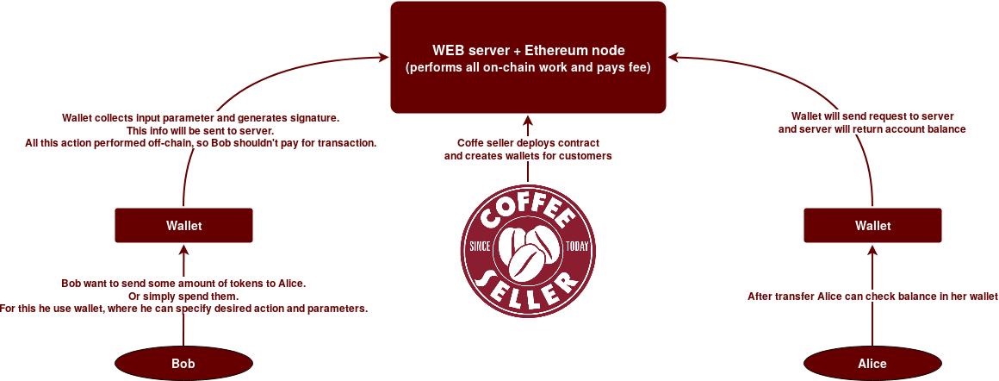
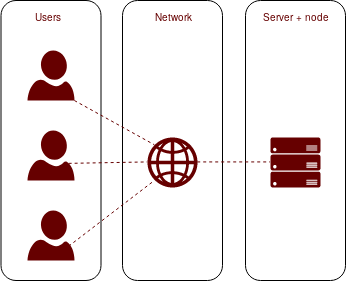
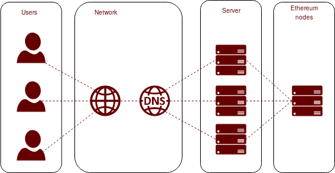
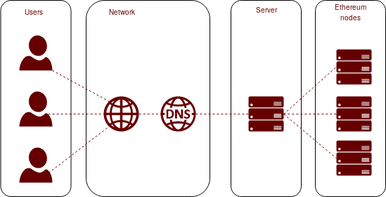
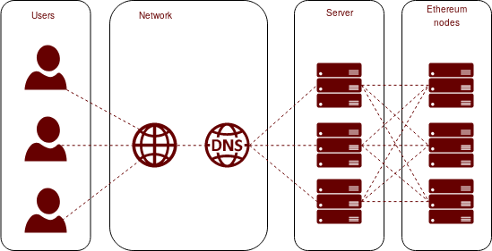

# Where it can be used


For example, Starbucks release own token. These tokens can be spent to purchase coffee. For this Starbucks created token smart contract and wallet for clients. Bob received 10 tokens from Starbucks, and he wants to send 5 token to Alice. For this Bob can use Starbucks wallet, which will prepare transaction parameters and send them to Starbucks. Signing and sending performed off-chain, so there is no fee for that. When Starbucks received signed parameters and crates on-chain transaction from itself. Now transaction performed on-chain and Starbucks pays transaction fee for Bob. Smartcontract can verify parameters with Bob signature, and after check it will send 5 tokens from Bob to Alice.


# How it works
All on-chain actions are performed by the remote HTTP server. Web pages can only send or get some parameters with GET/POST HTTP requests or generate signatures based on specified private key.


The main idea is sending transaction parameters and signature to remote server, which will perform on-chain transaction.First, web client will receive a nonce parameter for specified address from an http server, which will get nonce from the token contract by calling getAccountNonce ().

After nonce received by wallet, it will calculate signature based on wallet address, receiver address, tokens mount and nonce.

> Nonce is amount of transactions for account. In our case it's amount of specified token transaction. It stored in token contract and increased by 1 after any successfull transaction. We need it to protect account against multiple sending of same signed transaction.

Then transaction parameters with calculated signature and token address will be sent to the http server. And http server will try to perform the transaction. All work is done in transferPreSigned () function, sender address will be recovered from the signature and passed parameters. And if everything is fine then tokens will be transferred from wallet address to the receiver.
As all on-chain action will be performed on the server, all transaction fees will be paid only by the server.

# Solution scalability
In theory, most loaded part is web server with Ethereum node. Current solution looks like this:


In case with big amount of simultaneous connections we can separate ethereum node and webserver, and add more servers for hanling requests. We can achive this with round robin DNS.


In case with high transactions frequency we can add more nodes. We should add using of multiple providers to server part.


Or we can use both methods or even add more web servers or nodes dynamically.



# Repository structure
  - contracts - smart contract source code
  - web - html pages for wallet and token creator
  - http_server - js server files
  - http_server/out - compiled abi and bytecode of used contracts

# Building
To build the smart contract, first install dependencies:

``` npm install openzeppelin-solidity ```

Then compile the smart contract using `solc`.

In case if solc was installed not by npm you should specify prefix for imported files.

```solc <params> openzeppelin-solidity=node_modules/openzeppelin-solidity/contracts```

# How to run PoC
First you need to install http server dependencies.
For http server used [express](https://expressjs.com/) framework.

```npm install express --save```

For interaction with ethereum node used [web3](https://github.com/ethereum/web3.js/).

```npm install web3```

> In some cases you should init node project before installing dependencies. You can do this with ```npm init```.

Before starting script you should change hardcoded web3 provider and default account in [http_server/helpers.js](http_server/helpers.js). All on-chain operations will be performed from that account, so this account should be unlocked and should be able to pay transaction fees.
Also, contracts deployed by this server will be owned by default account. This is important because only owner allowed to perform preSignedTransactions.
Other hardcoded parameters are paths to files with contract abi and byte code. But for running this PoC you don't need to change anything.

After installing dependencies and changing hardcoded parameters http server can be started with:

```cd http_server & node http_server.js```

> In current implementation most errors not handled, so be careful

Now pages from [web]() directory can be used.
First, you should deploy new token contract. Open [deployToken.html](web/deployToken.html), enter needed parameters and create new contracts. After some time address of the new token will appear under the submit button. This address should be used in wallets for choosing tokens to work with.

To send tokens [wallet.html](web/wallet.html) can be used. You should specify token address and wallet address. With this info you can check wallet balance.
To send transaction you need private key. You can specify it manually or open JSON key file (I tested key files generated by parity).
After, you should set receiver address, token amount and press "Submit". After you can update current wallet balance or check receiver balance.
